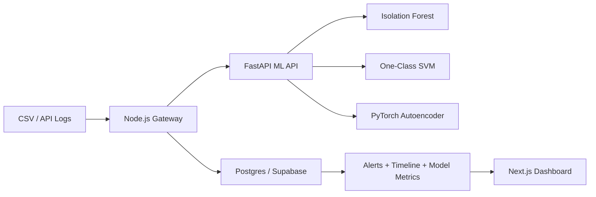

# Architecture

## Flow

1. Logs arrive via `POST /api/ingest` or `POST /api/upload`.
2. Gateway normalizes records and calls ML API `/detect`.
3. ML API engineers features and scores each event across models.
4. Gateway stores raw logs + detections in Postgres.
5. High/critical anomalies become alerts.
6. Dashboard reads timeline, alerts, and threat feed from gateway.

## Threat Scoring Inputs

- Model anomaly score (primary signal)
- Signature hints (`sql`, traversal, admin scans)
- Error status frequency
- Per-IP request rate spike

## Supabase Compatibility

Schema uses plain Postgres types (`jsonb`, `timestamptz`, indexes), so it runs unchanged on Supabase Postgres.

